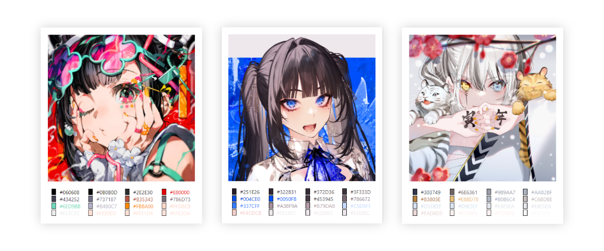

# palette

An application written on Rust which gets an image's palette and export results as a web page.



## Example

```powershell
./palette.exe -s folder/image.jpg -c 8
```

**Result:** exports *index.html* in the directory with your image.

## Commands

```
palette 0.1.0

USAGE:
    palette.exe [OPTIONS] --src <SRC>

OPTIONS:
    -c, --colors <COLORS>    Number of shades you want to get [default: 8]
    -h, --help               Print help information
        --no-export          Doesn't export palette web page
    -o, --out <OUT>          Export an image (e.g --out assets/new_img.jpg) [default: ]
    -s, --src <SRC>          Source image (e.g. --src assets/img.jpg)
        --silent             Doesn't print an array of palette's shades
    -V, --version            Print version information
```